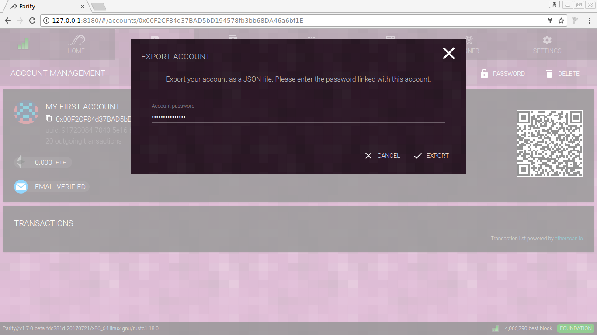
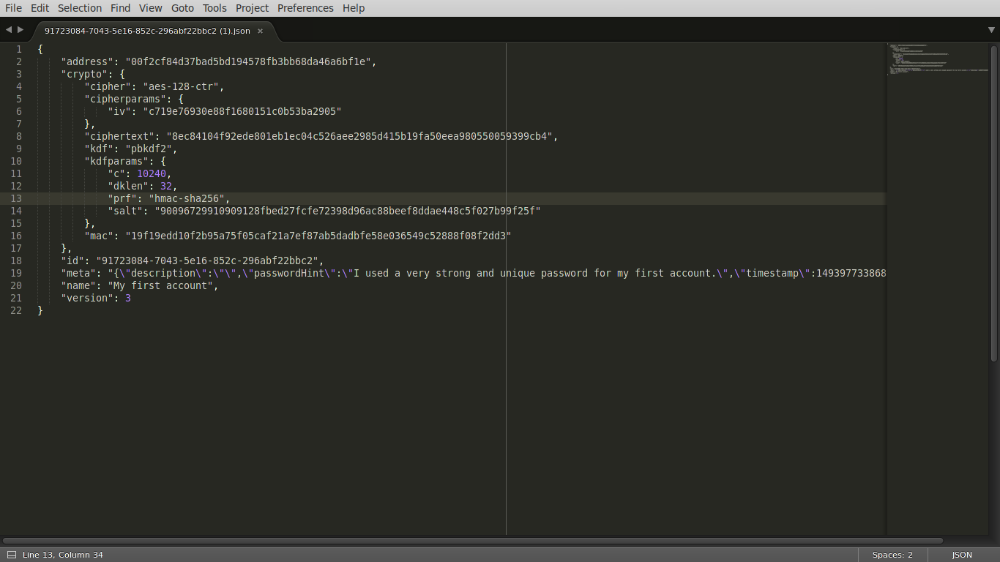
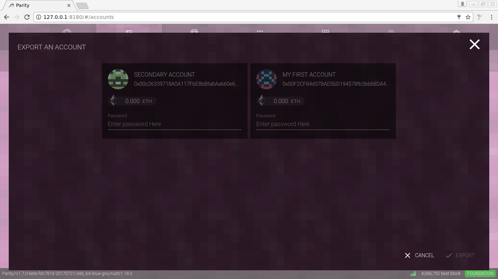
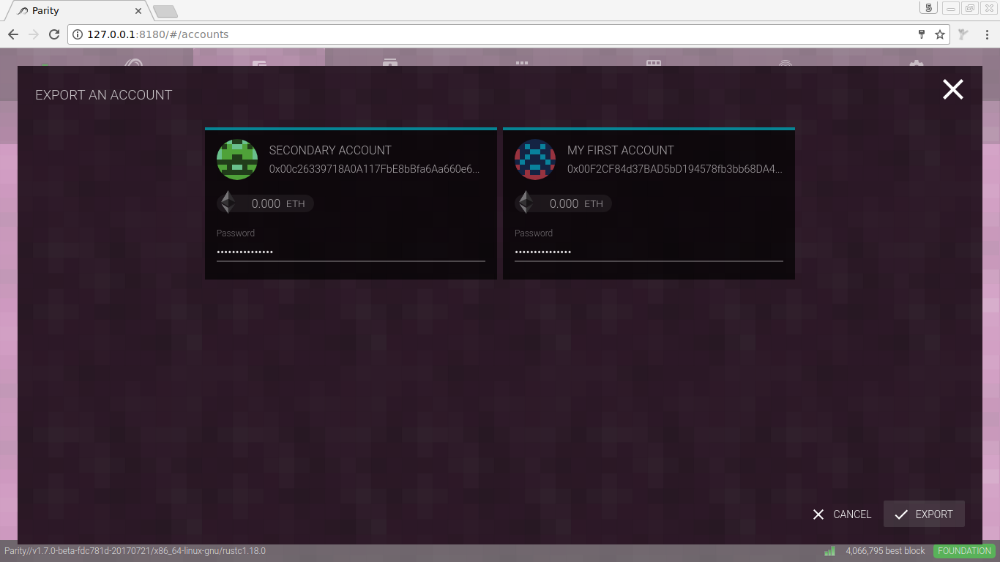
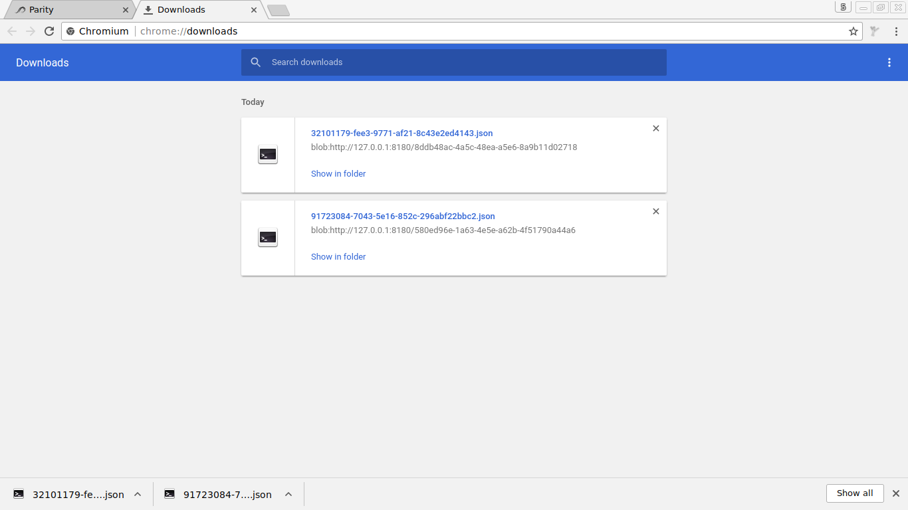

# Backing up and Restoring

It's generally sensible to back up your keys and recovery phrases.

### Role of Parity recovery phrases

The Parity recovery phrase is a 12-word mnemonic phrase allowing you to have an additional backup. It's displayed once after account creation and should be written down or printed out and kept in a safe place. This phrase is not protected with any password or encryption and should always kept offline and _cold_. In the rare case that your encrypted backups (see below) are corrupted or lost, the phrase allows you to fully recover your private key.

### Exporting accounts via the Wallet UI

The most convenient way to backup your accounts is via the wallet UI which offers direct export of the encrypted key files in JSON format.

##### A single account

To backup a single account, just open your accounts view, click the account you wish to export, and find the **EXPORT** button.


_Once you enter your passphrase and confirm, the key will be exported and downloaded to your disk._


_The backup is a password-encrypted JSON-file._

##### All accounts at once

To backup multiple accounts, or all accounts at once, just open your accounts view and find the **EXPORT** button.


_Toggle which accounts you wish to export by clicking them, and thus enabling or disabling the account export._


_Enter the password for each account you wish to export and confirm._


_The backup is a set of password-encrypted JSON-files stored to your disk._

### Exporting accounts via CLI

If the wallet UI is not available or not desired, keys can be backed up via JSON-RPC API or by manually copying and archiving the files.

##### Available RPC APIs

The `parity_exportAccount` is exactly designed to retrieve the password-encrypted JSON backup via RPC.

```bash
curl --data '{"method":"parity_exportAccount","params":["0x007d73d8a49eeb85d32cf465507dd71d507100c1","hunter2"],"id":1,"jsonrpc":"2.0"}' -H "Content-Type: application/json" -X POST localhost:8545
```

The required parameters are the account to export and the password used to protect it.

##### Manual archiving via CLI

Via CLI, this is simply a case of copying a particular directory. Here's how you can do it...

- on Mac:
```bash
cd $HOME/Library/Application\ Support/io.parity.ethereum/keys && tar czf $HOME/Desktop/parity-keys-backup.tgz *
```

- on Linux:
```bash
cd $HOME/.local/share/io.parity.ethereum/keys && tar czf $HOME/Desktop/parity-keys-backup.tgz *
```

- on Windows, the key folder can be found at `%HOMEPATH%/AppData/Roaming/Parity/Ethereum/keys`.

You will get a file `parity-keys-backup.tgz` in your `Desktop` path (which should therefore show up on your desktop). You can move it wherever you want - a USB pen drive might be sensible.

### Backing up wallets and vaults

To backup a simple contract wallet or multi-signature wallet, all you need to do is to remember the public address, and - of course - having backups of the associated owner accounts (see above for instructions).

To backup a complete vault, just backup the full directory containing the `vault.json` and all encrypted key files to a secure location. This directory is a sub-directory of your keys path, usually named after your vault.

### Restoring options

Restoring options work analogue to the backup options explained above.

##### Wallet UI

The user interface allows you to **import** keys from:

- Geth Keystore: This allows importing keys created in with the go-ethereum client.
- JSON Backup: This allows importing password-encrypted JSON key-files previously exported with Parity.
- Private Keys: This allows importing plain, unencrypted private keys generated with any other application.
- Presale Wallet: This allows importing a wallet from the initial Ether pre-sale maintained by the Ethereum Foundation.

In addition, it's possible to **restore** private keys from the 12-word mnemonic recovery phrase.

##### Command line

To restore from a previous CLI backup...

- on Mac:

```bash
cd $HOME/Library/Application Support/io.parity.ethereum/keys && tar xzf $HOME/Desktop/parity-keys-backup.tgz *
```

- on Linux:

```bash
cd $HOME/.local/share/io.parity.ethereum/keys && tar xzf $HOME/Desktop/parity-keys-backup.tgz *
```

This assumes our previously created backup is located on your Desktop.
