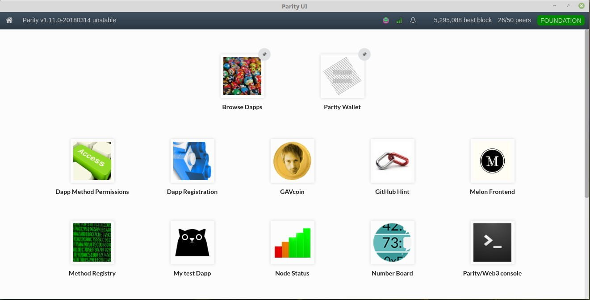
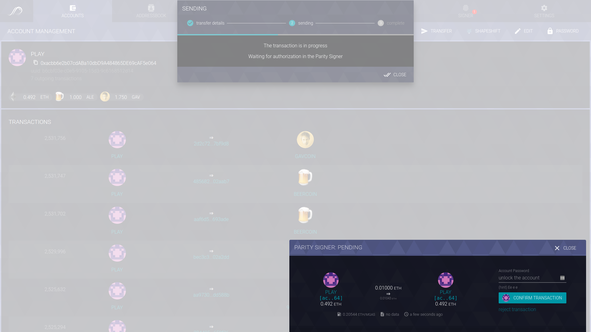

## Parity UI isn't actively maintained anymore. 

## Parity UI alternatives

### View and send Ether and tokens

As Parity UI is not working properly with Parity Ethereum >2.0, you can use [MyCrypto Desktop app](https://download.mycrypto.com/) connected to a local full node to interact with your accounts. Follow [these steps](https://support.mycrypto.com/networks/run-your-own-node-with-mycrypto.html) to connect MyCrypto Desktop to a local Parity Ethereum node. Parity UI accounts' JSON keystore files can be found at the following location:
- Mac OS X: `~/Library/Application\ Support/io.parity.ethereum/keys/ethereum/`
- Linux: `$HOME/.local/share/io.parity.ethereum/keys`
- Windows 7/10: `%HOMEPATH%/AppData/Roaming/Parity/Ethereum/keys`

Import an account to MyCrypto by selecting the corresponding JSON keystore file. You will require your account's password to unlock it (originally setup with Parity UI).

### Smart contract development

You can use [Remix](https://remix.ethereum.org/) connected to a local Parity Ethereum full node as an alternative to Parity UI for smart contracts development and deployment. Make sure that Remix is allowed to connect to your node by setting up the right [JSON-RPC cors policy](https://ethereum.stackexchange.com/questions/54639/is-it-possible-to-connect-remix-and-parity?rq=1).

## Usage

Parity Wallet is a component of Parity UI designed to integrate seamlessly with all standard Ethereum based tokens as well as Ether itself.
It is accessible in the Parity User Interface - [Parity UI](https://github.com/Parity-JS/shell/releases).
Starting from Parity v1.10, [Parity Ethereum client](https://github.com/paritytech/parity-ethereum/releases) (the node) has been separated from the Parity User Interface (UI). The user interface previously accessible from the browser in versions <=1.9 is now released as a standalone app.

To install Parity UI, you need to :
* download and install [Parity UI](https://github.com/Parity-JS/shell/releases)
* launch Parity UI (with your app launcher or in a terminal with `parity-ui`).

From here, you can access Parity Wallet by clicking on `Parity Wallet`. You will then be able manage accounts, create transactions and interact with DApps from the `Account` section.

## Secure Transaction Signer
The Secure Transaction Signer is a core piece of technology which ensures that no transaction can be sent from your accounts without your explicit approval. This means that you can interact with DApps without fear that they might attempt to drain your accounts. 

When a transaction request is made, you'll have to authenticate the request on Parity UI before the transaction can be signed  and relayed to the network. This is made to be as seamless as possible, and you can rest easy knowing your Ether are protected.

Here's a picture of it in action:

One more thing: see the purple-ish background? Every person's UI has its own unique, procedurally-generated background. This means that it's impossible for another site to pretend to be your signer.
